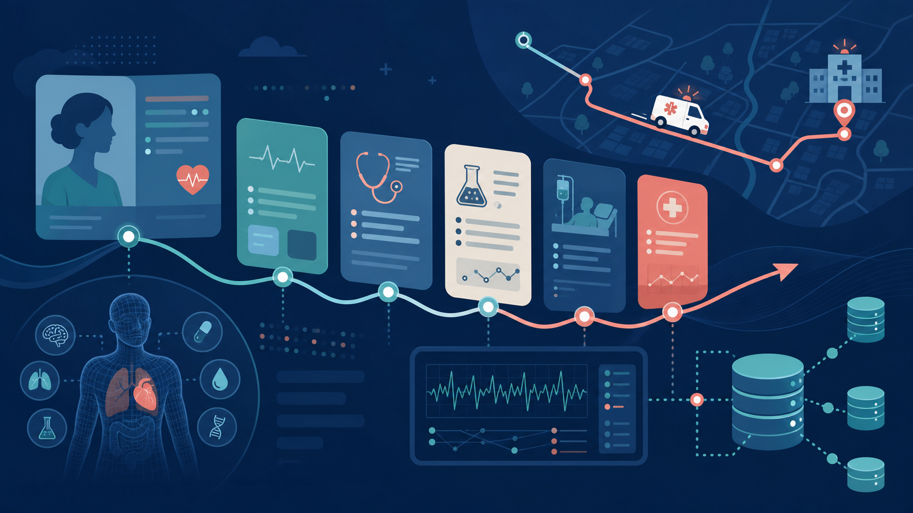

# Patient Chronicle Generator



로컬에서 합성 환자 히스토리·초진·구급/NEDIS 이벤트를 생성하기 위한 최소 실행 골격입니다. 기본값은 오프라인 결정적 데모이며, `OPENAI_API_KEY`를 설정하면 OpenAI 호환 Responses API를 사용합니다.

```bash
LLM_CONNECTOR=offline python3 app.py --output patient_chronicle.json --validate --project
python3 app.py -n 100 -o cohort.json
python3 validate_chronicle.py -i patient_chronicle.json -o validation_report.json
python3 cohort_audit.py -i cohort.json -o cohort_report.json
```

`LLM_CONNECTOR=codex`가 기본값이며 인증된 Codex CLI가 있으면 `codex exec`를 사용합니다. CLI가 없으면 OpenAI 호환 Responses API, API key도 없으면 오프라인 deterministic fallback으로 내려갑니다. `document_projection.py`는 Chronicle에서 초진기록지·구급활동일지·NEDIS-like JSON·줄바꿈 narrative를 생성하고 source lineage를 보존합니다.

품질 게이트: QG-0 합성표식/보안, QG-1 카탈로그, QG-2 schema·시간순서, QG-3 cohort 분포, QG-4 staged LLM/fallback, QG-5 문서 projection, QG-6 검증 리포트, QG-7 운영 패키지. 현재 구현은 QG-0~QG-6의 로컬 검증 골격이며 임상·법규 승인 전 운영 제품으로 간주하지 않습니다.

## 안전·운영 제한

이 저장소는 합성 교육·시뮬레이션용입니다. 실제 환자 식별정보를 입력하지 마십시오. 현재 구현은 의료기관 운영 승인, NEDIS 공식 제출, 진료 의사결정 자동화를 의미하지 않습니다. Codex/API 사용 시 데이터 반출 정책과 비용·rate limit을 별도로 확인해야 합니다.

생성물은 반드시 `synthetic=true`와 provenance를 포함해야 하며, 실제 환자 데이터·진료 의사결정을 대체하지 않습니다. 운영 전에는 인증/감사로그/암호화/PII 차단/스키마 검증 및 의료진 검토를 추가하세요.
